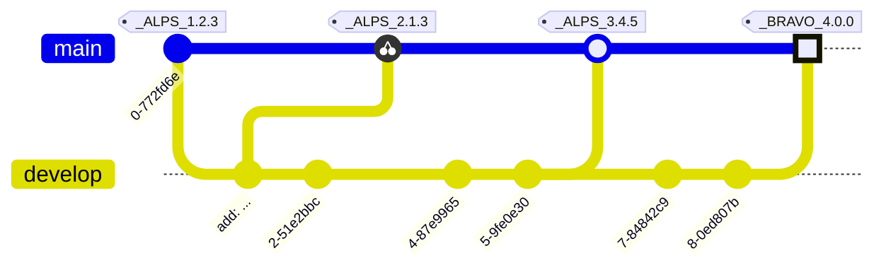

# RELEASE NOTES

All notable changes to this project will be documented in this file.

The format is based on [Keep a Changelog](https://keepachangelog.com/en/1.0.0/),
and this project adheres to a flavored version of [Semantic Versioning](https://semver.org/spec/v2.0.0.html).

<details>
<summary>See the spec for this SemVer flavor.</summary>
<h3>Epoch Scoped Semver</h3>
This flavor adds an optional marketable value called an `EPOCH`.
There is also an optional disambiguating `SCOPE` identifier for delineating tags for packages in a mono repo.

<blockquote>The motivation for this is to prevent resistance to utilising SemVer major bumps
correctly, by allowing a separate marketable identifier which is easily compatible
with the current SemVer spec.</blockquote>
An Epoch/Scope (**Sepoch**) is an OPTIONAL prefix to a typical SemVer.

* A Sepoch MUST BE bounded by `_` underscores `_`.

* The identifiers MUST BE ALPHABETICAL (A-Za-z) identifiers.

* The Epoch SHOULD BE upper case

* The Epoch MUST come before the Scope, if both are present.

* The Scope MUST additionally be bounded by `(` parenthesis `)`.

* The Scope SHOULD BE capitalised/pascal cased.

* A Sepoch CAN BE separated from SemVer by a single white space where this is allowed (ie not allowed in git tags).

* Epoch DOES NOT influence precedence.

* Scope MUST uniquely identify a single components versioning.

* Different scopes CANNOT BE compared for precedence.

* A SemVer without a Scope CAN BE compared to a Scoped SemVer for compatibility. But caution is advised.

> There is no enforcement for ordering EPOCHs in this spec, as it
would be overly restrictive and yield little value since we can delineate and
earlier EPOCH from a later EPOCH by the SemVers.
> 

**Examples:**



**While there are breaking changes between versions 1 to 3, we expect that it is less than
from 3 to 4. We expect the API surface would change more dramatically, or there is some other significant
milestone improvement, in the change from version 3 epoch ALPS to version 4 epoch BRAVO.**

```
_WILDLANDS(Core)_ 4.2.0
_WILDLANDS(Engine)_ 0.5.3
_DELTA(Core)_ 5.0.0
_DELTA(Engine)_ 0.5.3

```

**Cannot be compared to `Core` versions. Both Engine versions are equal, we can identify that
the ecosystems marketed change does not change the Engine packages API**

</details>
<details>
<summary>Quick navigation</summary>
<h3>Scopes:</h3>
<ul>
<li><a href="#activeelement">ActiveElement</a></li>
<li><a href="#audio">Audio</a></li>
<li><a href="#autofocus">AutoFocus</a></li>
<li><a href="#bounds">Bounds</a></li>
<li><a href="#broadcastchannel">BroadcastChannel</a></li>
<li><a href="#clipboard">Clipboard</a></li>
<li><a href="#common">Common</a></li>
<li><a href="#devices">Devices</a></li>
<li><a href="#eventbus">EventBus</a></li>
<li><a href="#eventlistener">EventListener</a></li>
<li><a href="#idle">Idle</a></li>
<li><a href="#keyboard">Keyboard</a></li>
<li><a href="#media">Media</a></li>
<li><a href="#mouse">Mouse</a></li>
<li><a href="#primitives">Primitives</a></li>
<li><a href="#raf">Raf</a></li>
<li><a href="#scheduled">Scheduled</a></li>
<li><a href="#scroll">Scroll</a></li>
<li><a href="#spring">Spring</a></li>
<li><a href="#timer">Timer</a></li>
<li><a href="#trigger">Trigger</a></li>
<li><a href="#tween">Tween</a></li>
</ul>
</details>
-----------------------

# ActiveElement

## [UNRELEASED](https://github.com/shayanhabibi/Partas.Solid.Primitives/compare/_%28ActiveElement%29_0.2.0...HEAD)

-----------------------

# Audio

## [UNRELEASED](https://github.com/shayanhabibi/Partas.Solid.Primitives/compare/_%28Audio%29_0.1.0...HEAD)

* Simplify usage and namespaces (#1) - cabboose@[120be](https://github.com/shayanhabibi/Partas.Solid.Primitives/commit/120bebf6ac9680d3f7892df270b37d29864e4304)
  

* fantomas - shayanhabibi@[a8f38](https://github.com/shayanhabibi/Partas.Solid.Primitives/commit/a8f3849c1a9cb589d98cc1220f79e5fbb80378bc)
  

* add assembly infos to projects - shayanhabibi@[8d03f](https://github.com/shayanhabibi/Partas.Solid.Primitives/commit/8d03fad141ec40953202c08ef2edbf9df818fc23)
  

* Add CI workflow using Partas.GitNet (#4) - cabboose@[c3975](https://github.com/shayanhabibi/Partas.Solid.Primitives/commit/c3975e312800671b18cc2608bbd294fbe13ee448)
  

* Add initial project files for Solid-js primitives bindings - cabboose@[968b5](https://github.com/shayanhabibi/Partas.Solid.Primitives/commit/968b55fcd4fa5913c84adb7374f3aef79c5acc61)
  

-----------------------

# AutoFocus

## [UNRELEASED](https://github.com/shayanhabibi/Partas.Solid.Primitives/compare/_%28AutoFocus%29_0.1.0...HEAD)

* Simplify usage and namespaces (#1) - cabboose@[120be](https://github.com/shayanhabibi/Partas.Solid.Primitives/commit/120bebf6ac9680d3f7892df270b37d29864e4304)
  

* fantomas - shayanhabibi@[a8f38](https://github.com/shayanhabibi/Partas.Solid.Primitives/commit/a8f3849c1a9cb589d98cc1220f79e5fbb80378bc)
  

* Update string literal paths and bump package versions - cabboose@[ae750](https://github.com/shayanhabibi/Partas.Solid.Primitives/commit/ae7506af672962ccd429029f18ee7808fbf62a79)
  

* add assembly infos to projects - shayanhabibi@[8d03f](https://github.com/shayanhabibi/Partas.Solid.Primitives/commit/8d03fad141ec40953202c08ef2edbf9df818fc23)
  

* Add CI workflow using Partas.GitNet (#4) - cabboose@[c3975](https://github.com/shayanhabibi/Partas.Solid.Primitives/commit/c3975e312800671b18cc2608bbd294fbe13ee448)
  

* Add initial project files for Solid-js primitives bindings - cabboose@[968b5](https://github.com/shayanhabibi/Partas.Solid.Primitives/commit/968b55fcd4fa5913c84adb7374f3aef79c5acc61)
  

-----------------------

# Bounds

## [UNRELEASED](https://github.com/shayanhabibi/Partas.Solid.Primitives/compare/_%28Bounds%29_0.2.0...HEAD)

* Simplify usage and namespaces (#1) - cabboose@[120be](https://github.com/shayanhabibi/Partas.Solid.Primitives/commit/120bebf6ac9680d3f7892df270b37d29864e4304)
  

* fantomas - shayanhabibi@[a8f38](https://github.com/shayanhabibi/Partas.Solid.Primitives/commit/a8f3849c1a9cb589d98cc1220f79e5fbb80378bc)
  

* Update string literal paths and bump package versions - cabboose@[ae750](https://github.com/shayanhabibi/Partas.Solid.Primitives/commit/ae7506af672962ccd429029f18ee7808fbf62a79)
  

* add assembly infos to projects - shayanhabibi@[8d03f](https://github.com/shayanhabibi/Partas.Solid.Primitives/commit/8d03fad141ec40953202c08ef2edbf9df818fc23)
  

* Add CI workflow using Partas.GitNet (#4) - cabboose@[c3975](https://github.com/shayanhabibi/Partas.Solid.Primitives/commit/c3975e312800671b18cc2608bbd294fbe13ee448)
  

* Add initial project files for Solid-js primitives bindings - cabboose@[968b5](https://github.com/shayanhabibi/Partas.Solid.Primitives/commit/968b55fcd4fa5913c84adb7374f3aef79c5acc61)
  

-----------------------

# BroadcastChannel

## [UNRELEASED](https://github.com/shayanhabibi/Partas.Solid.Primitives/compare/_%28BroadcastChannel%29_0.2.0...HEAD)

* Simplify usage and namespaces (#1) - cabboose@[120be](https://github.com/shayanhabibi/Partas.Solid.Primitives/commit/120bebf6ac9680d3f7892df270b37d29864e4304)
  

* fantomas - shayanhabibi@[a8f38](https://github.com/shayanhabibi/Partas.Solid.Primitives/commit/a8f3849c1a9cb589d98cc1220f79e5fbb80378bc)
  

* Update string literal paths and bump package versions - cabboose@[ae750](https://github.com/shayanhabibi/Partas.Solid.Primitives/commit/ae7506af672962ccd429029f18ee7808fbf62a79)
  

* add assembly infos to projects - shayanhabibi@[8d03f](https://github.com/shayanhabibi/Partas.Solid.Primitives/commit/8d03fad141ec40953202c08ef2edbf9df818fc23)
  

* Add CI workflow using Partas.GitNet (#4) - cabboose@[c3975](https://github.com/shayanhabibi/Partas.Solid.Primitives/commit/c3975e312800671b18cc2608bbd294fbe13ee448)
  

* Add initial project files for Solid-js primitives bindings - cabboose@[968b5](https://github.com/shayanhabibi/Partas.Solid.Primitives/commit/968b55fcd4fa5913c84adb7374f3aef79c5acc61)
  

-----------------------

# Clipboard

## [UNRELEASED](https://github.com/shayanhabibi/Partas.Solid.Primitives/compare/_%28Clipboard%29_0.2.0...HEAD)

* Simplify usage and namespaces (#1) - cabboose@[120be](https://github.com/shayanhabibi/Partas.Solid.Primitives/commit/120bebf6ac9680d3f7892df270b37d29864e4304)
  

* fantomas - shayanhabibi@[a8f38](https://github.com/shayanhabibi/Partas.Solid.Primitives/commit/a8f3849c1a9cb589d98cc1220f79e5fbb80378bc)
  

* Update string literal paths and bump package versions - cabboose@[ae750](https://github.com/shayanhabibi/Partas.Solid.Primitives/commit/ae7506af672962ccd429029f18ee7808fbf62a79)
  

* add assembly infos to projects - shayanhabibi@[8d03f](https://github.com/shayanhabibi/Partas.Solid.Primitives/commit/8d03fad141ec40953202c08ef2edbf9df818fc23)
  

* Add CI workflow using Partas.GitNet (#4) - cabboose@[c3975](https://github.com/shayanhabibi/Partas.Solid.Primitives/commit/c3975e312800671b18cc2608bbd294fbe13ee448)
  

* Add initial project files for Solid-js primitives bindings - cabboose@[968b5](https://github.com/shayanhabibi/Partas.Solid.Primitives/commit/968b55fcd4fa5913c84adb7374f3aef79c5acc61)
  

-----------------------

# Common

## [UNRELEASED](https://github.com/shayanhabibi/Partas.Solid.Primitives/compare/_%28Common%29_0.1.0...HEAD)

* Simplify usage and namespaces (#1) - cabboose@[120be](https://github.com/shayanhabibi/Partas.Solid.Primitives/commit/120bebf6ac9680d3f7892df270b37d29864e4304)
  

* fantomas - shayanhabibi@[a8f38](https://github.com/shayanhabibi/Partas.Solid.Primitives/commit/a8f3849c1a9cb589d98cc1220f79e5fbb80378bc)
  

* add assembly infos to projects - shayanhabibi@[8d03f](https://github.com/shayanhabibi/Partas.Solid.Primitives/commit/8d03fad141ec40953202c08ef2edbf9df818fc23)
  

* Add CI workflow using Partas.GitNet (#4) - cabboose@[c3975](https://github.com/shayanhabibi/Partas.Solid.Primitives/commit/c3975e312800671b18cc2608bbd294fbe13ee448)
  

* Add initial project files for Solid-js primitives bindings - cabboose@[968b5](https://github.com/shayanhabibi/Partas.Solid.Primitives/commit/968b55fcd4fa5913c84adb7374f3aef79c5acc61)
  

-----------------------

# Devices

## [UNRELEASED](https://github.com/shayanhabibi/Partas.Solid.Primitives/compare/_%28Devices%29_0.1.0...HEAD)

* Simplify usage and namespaces (#1) - cabboose@[120be](https://github.com/shayanhabibi/Partas.Solid.Primitives/commit/120bebf6ac9680d3f7892df270b37d29864e4304)
  

* fantomas - shayanhabibi@[a8f38](https://github.com/shayanhabibi/Partas.Solid.Primitives/commit/a8f3849c1a9cb589d98cc1220f79e5fbb80378bc)
  

* add assembly infos to projects - shayanhabibi@[8d03f](https://github.com/shayanhabibi/Partas.Solid.Primitives/commit/8d03fad141ec40953202c08ef2edbf9df818fc23)
  

* Add CI workflow using Partas.GitNet (#4) - cabboose@[c3975](https://github.com/shayanhabibi/Partas.Solid.Primitives/commit/c3975e312800671b18cc2608bbd294fbe13ee448)
  

* Add initial project files for Solid-js primitives bindings - cabboose@[968b5](https://github.com/shayanhabibi/Partas.Solid.Primitives/commit/968b55fcd4fa5913c84adb7374f3aef79c5acc61)
  

-----------------------

# EventBus

## [UNRELEASED](https://github.com/shayanhabibi/Partas.Solid.Primitives/compare/_%28EventBus%29_0.2.0...HEAD)

* Simplify usage and namespaces (#1) - cabboose@[120be](https://github.com/shayanhabibi/Partas.Solid.Primitives/commit/120bebf6ac9680d3f7892df270b37d29864e4304)
  

* fantomas - shayanhabibi@[a8f38](https://github.com/shayanhabibi/Partas.Solid.Primitives/commit/a8f3849c1a9cb589d98cc1220f79e5fbb80378bc)
  

* Update string literal paths and bump package versions - cabboose@[ae750](https://github.com/shayanhabibi/Partas.Solid.Primitives/commit/ae7506af672962ccd429029f18ee7808fbf62a79)
  

* add assembly infos to projects - shayanhabibi@[8d03f](https://github.com/shayanhabibi/Partas.Solid.Primitives/commit/8d03fad141ec40953202c08ef2edbf9df818fc23)
  

* Add CI workflow using Partas.GitNet (#4) - cabboose@[c3975](https://github.com/shayanhabibi/Partas.Solid.Primitives/commit/c3975e312800671b18cc2608bbd294fbe13ee448)
  

* Add initial project files for Solid-js primitives bindings - cabboose@[968b5](https://github.com/shayanhabibi/Partas.Solid.Primitives/commit/968b55fcd4fa5913c84adb7374f3aef79c5acc61)
  

-----------------------

# EventListener

## [UNRELEASED](https://github.com/shayanhabibi/Partas.Solid.Primitives/compare/_%28EventListener%29_0.1.0...HEAD)

* Simplify usage and namespaces (#1) - cabboose@[120be](https://github.com/shayanhabibi/Partas.Solid.Primitives/commit/120bebf6ac9680d3f7892df270b37d29864e4304)
  

* fantomas - shayanhabibi@[a8f38](https://github.com/shayanhabibi/Partas.Solid.Primitives/commit/a8f3849c1a9cb589d98cc1220f79e5fbb80378bc)
  

* add assembly infos to projects - shayanhabibi@[8d03f](https://github.com/shayanhabibi/Partas.Solid.Primitives/commit/8d03fad141ec40953202c08ef2edbf9df818fc23)
  

* Add CI workflow using Partas.GitNet (#4) - cabboose@[c3975](https://github.com/shayanhabibi/Partas.Solid.Primitives/commit/c3975e312800671b18cc2608bbd294fbe13ee448)
  

* Add initial project files for Solid-js primitives bindings - cabboose@[968b5](https://github.com/shayanhabibi/Partas.Solid.Primitives/commit/968b55fcd4fa5913c84adb7374f3aef79c5acc61)
  

-----------------------

# Idle

## [UNRELEASED](https://github.com/shayanhabibi/Partas.Solid.Primitives/compare/_%28Idle%29_0.2.0...HEAD)

* Simplify usage and namespaces (#1) - cabboose@[120be](https://github.com/shayanhabibi/Partas.Solid.Primitives/commit/120bebf6ac9680d3f7892df270b37d29864e4304)
  

* fantomas - shayanhabibi@[a8f38](https://github.com/shayanhabibi/Partas.Solid.Primitives/commit/a8f3849c1a9cb589d98cc1220f79e5fbb80378bc)
  

* Update string literal paths and bump package versions - cabboose@[ae750](https://github.com/shayanhabibi/Partas.Solid.Primitives/commit/ae7506af672962ccd429029f18ee7808fbf62a79)
  

* add assembly infos to projects - shayanhabibi@[8d03f](https://github.com/shayanhabibi/Partas.Solid.Primitives/commit/8d03fad141ec40953202c08ef2edbf9df818fc23)
  

* Add CI workflow using Partas.GitNet (#4) - cabboose@[c3975](https://github.com/shayanhabibi/Partas.Solid.Primitives/commit/c3975e312800671b18cc2608bbd294fbe13ee448)
  

* Add initial project files for Solid-js primitives bindings - cabboose@[968b5](https://github.com/shayanhabibi/Partas.Solid.Primitives/commit/968b55fcd4fa5913c84adb7374f3aef79c5acc61)
  

-----------------------

# Keyboard

## [UNRELEASED](https://github.com/shayanhabibi/Partas.Solid.Primitives/compare/_%28Keyboard%29_0.2.0...HEAD)

* Simplify usage and namespaces (#1) - cabboose@[120be](https://github.com/shayanhabibi/Partas.Solid.Primitives/commit/120bebf6ac9680d3f7892df270b37d29864e4304)
  

* fantomas - shayanhabibi@[a8f38](https://github.com/shayanhabibi/Partas.Solid.Primitives/commit/a8f3849c1a9cb589d98cc1220f79e5fbb80378bc)
  

* Update string literal paths and bump package versions - cabboose@[ae750](https://github.com/shayanhabibi/Partas.Solid.Primitives/commit/ae7506af672962ccd429029f18ee7808fbf62a79)
  

* add assembly infos to projects - shayanhabibi@[8d03f](https://github.com/shayanhabibi/Partas.Solid.Primitives/commit/8d03fad141ec40953202c08ef2edbf9df818fc23)
  

* Add CI workflow using Partas.GitNet (#4) - cabboose@[c3975](https://github.com/shayanhabibi/Partas.Solid.Primitives/commit/c3975e312800671b18cc2608bbd294fbe13ee448)
  

* Add initial project files for Solid-js primitives bindings - cabboose@[968b5](https://github.com/shayanhabibi/Partas.Solid.Primitives/commit/968b55fcd4fa5913c84adb7374f3aef79c5acc61)
  

-----------------------

# Media

## [UNRELEASED](https://github.com/shayanhabibi/Partas.Solid.Primitives/compare/_%28Media%29_0.2.0...HEAD)

* Simplify usage and namespaces (#1) - cabboose@[120be](https://github.com/shayanhabibi/Partas.Solid.Primitives/commit/120bebf6ac9680d3f7892df270b37d29864e4304)
  

* fantomas - shayanhabibi@[a8f38](https://github.com/shayanhabibi/Partas.Solid.Primitives/commit/a8f3849c1a9cb589d98cc1220f79e5fbb80378bc)
  

* Update string literal paths and bump package versions - cabboose@[ae750](https://github.com/shayanhabibi/Partas.Solid.Primitives/commit/ae7506af672962ccd429029f18ee7808fbf62a79)
  

* add assembly infos to projects - shayanhabibi@[8d03f](https://github.com/shayanhabibi/Partas.Solid.Primitives/commit/8d03fad141ec40953202c08ef2edbf9df818fc23)
  

* Add CI workflow using Partas.GitNet (#4) - cabboose@[c3975](https://github.com/shayanhabibi/Partas.Solid.Primitives/commit/c3975e312800671b18cc2608bbd294fbe13ee448)
  

* Add initial project files for Solid-js primitives bindings - cabboose@[968b5](https://github.com/shayanhabibi/Partas.Solid.Primitives/commit/968b55fcd4fa5913c84adb7374f3aef79c5acc61)
  

-----------------------

# Mouse

## [UNRELEASED](https://github.com/shayanhabibi/Partas.Solid.Primitives/compare/_%28Mouse%29_0.2.0...HEAD)

* =MOUSE= REFACTOR: Type signatures now use U4<#HtmlElement, #Element, Document, Window> to better provide accessibility as per the source typings - cabboose@[36668](https://github.com/shayanhabibi/Partas.Solid.Primitives/commit/366688030fcab6e1b2da63fc2d8d52dc5daafe43)
  

* =MOUSE= ADDED: Added bindings - cabboose@[f6dcd](https://github.com/shayanhabibi/Partas.Solid.Primitives/commit/f6dcd731900a51504858d0d672eca0a7c1d50aec)
  

* Simplify usage and namespaces (#1) - cabboose@[120be](https://github.com/shayanhabibi/Partas.Solid.Primitives/commit/120bebf6ac9680d3f7892df270b37d29864e4304)
  

* fantomas - shayanhabibi@[a8f38](https://github.com/shayanhabibi/Partas.Solid.Primitives/commit/a8f3849c1a9cb589d98cc1220f79e5fbb80378bc)
  

* =MOUSE= HOTFIX: Remove # to prevent compiler type ambiguity - cabboose@[43f2a](https://github.com/shayanhabibi/Partas.Solid.Primitives/commit/43f2a1edf0b48fdb3e7839db33d4198089dcafea)
  

* add assembly infos to projects - shayanhabibi@[8d03f](https://github.com/shayanhabibi/Partas.Solid.Primitives/commit/8d03fad141ec40953202c08ef2edbf9df818fc23)
  

* Add CI workflow using Partas.GitNet (#4) - cabboose@[c3975](https://github.com/shayanhabibi/Partas.Solid.Primitives/commit/c3975e312800671b18cc2608bbd294fbe13ee448)
  

* Add initial project files for Solid-js primitives bindings - cabboose@[968b5](https://github.com/shayanhabibi/Partas.Solid.Primitives/commit/968b55fcd4fa5913c84adb7374f3aef79c5acc61)
  

-----------------------

# Primitives

## [UNRELEASED](https://github.com/shayanhabibi/Partas.Solid.Primitives/compare/_%28Primitives%29_0.3.0...HEAD)

* Simplify usage and namespaces (#1) - cabboose@[120be](https://github.com/shayanhabibi/Partas.Solid.Primitives/commit/120bebf6ac9680d3f7892df270b37d29864e4304)
  

* testing gitnet patching - shayanhabibi@[553e9](https://github.com/shayanhabibi/Partas.Solid.Primitives/commit/553e94de7ff54547d8769327323bb5dc54f963c5)
  

* fantomas - shayanhabibi@[a8f38](https://github.com/shayanhabibi/Partas.Solid.Primitives/commit/a8f3849c1a9cb589d98cc1220f79e5fbb80378bc)
  

* Update string literal paths and bump package versions - cabboose@[ae750](https://github.com/shayanhabibi/Partas.Solid.Primitives/commit/ae7506af672962ccd429029f18ee7808fbf62a79)
  

* add assembly infos to projects - shayanhabibi@[8d03f](https://github.com/shayanhabibi/Partas.Solid.Primitives/commit/8d03fad141ec40953202c08ef2edbf9df818fc23)
  

* Add CI workflow using Partas.GitNet (#4) - cabboose@[c3975](https://github.com/shayanhabibi/Partas.Solid.Primitives/commit/c3975e312800671b18cc2608bbd294fbe13ee448)
  

* Add initial project files for Solid-js primitives bindings - cabboose@[968b5](https://github.com/shayanhabibi/Partas.Solid.Primitives/commit/968b55fcd4fa5913c84adb7374f3aef79c5acc61)
  

-----------------------

# Raf

## [UNRELEASED](https://github.com/shayanhabibi/Partas.Solid.Primitives/compare/_%28Raf%29_0.2.0...HEAD)

* =RAF= ADDED: Added bindings to @solid-primitives/raf - cabboose@[1eaa1](https://github.com/shayanhabibi/Partas.Solid.Primitives/commit/1eaa159caa8c3dfba2a6d86eae1ec460628a45d3)
  

* Simplify usage and namespaces (#1) - cabboose@[120be](https://github.com/shayanhabibi/Partas.Solid.Primitives/commit/120bebf6ac9680d3f7892df270b37d29864e4304)
  

* fantomas - shayanhabibi@[a8f38](https://github.com/shayanhabibi/Partas.Solid.Primitives/commit/a8f3849c1a9cb589d98cc1220f79e5fbb80378bc)
  

* add assembly infos to projects - shayanhabibi@[8d03f](https://github.com/shayanhabibi/Partas.Solid.Primitives/commit/8d03fad141ec40953202c08ef2edbf9df818fc23)
  

* Add CI workflow using Partas.GitNet (#4) - cabboose@[c3975](https://github.com/shayanhabibi/Partas.Solid.Primitives/commit/c3975e312800671b18cc2608bbd294fbe13ee448)
  

* Add initial project files for Solid-js primitives bindings - cabboose@[968b5](https://github.com/shayanhabibi/Partas.Solid.Primitives/commit/968b55fcd4fa5913c84adb7374f3aef79c5acc61)
  

-----------------------

# Scheduled

## [UNRELEASED](https://github.com/shayanhabibi/Partas.Solid.Primitives/compare/_%28Scheduled%29_0.2.0...HEAD)

* Simplify usage and namespaces (#1) - cabboose@[120be](https://github.com/shayanhabibi/Partas.Solid.Primitives/commit/120bebf6ac9680d3f7892df270b37d29864e4304)
  

* fantomas - shayanhabibi@[a8f38](https://github.com/shayanhabibi/Partas.Solid.Primitives/commit/a8f3849c1a9cb589d98cc1220f79e5fbb80378bc)
  

* Update string literal paths and bump package versions - cabboose@[ae750](https://github.com/shayanhabibi/Partas.Solid.Primitives/commit/ae7506af672962ccd429029f18ee7808fbf62a79)
  

* add assembly infos to projects - shayanhabibi@[8d03f](https://github.com/shayanhabibi/Partas.Solid.Primitives/commit/8d03fad141ec40953202c08ef2edbf9df818fc23)
  

* Add CI workflow using Partas.GitNet (#4) - cabboose@[c3975](https://github.com/shayanhabibi/Partas.Solid.Primitives/commit/c3975e312800671b18cc2608bbd294fbe13ee448)
  

* Add initial project files for Solid-js primitives bindings - cabboose@[968b5](https://github.com/shayanhabibi/Partas.Solid.Primitives/commit/968b55fcd4fa5913c84adb7374f3aef79c5acc61)
  

-----------------------

# Scroll

## [UNRELEASED](https://github.com/shayanhabibi/Partas.Solid.Primitives/compare/_%28Scroll%29_0.2.0...HEAD)

* Simplify usage and namespaces (#1) - cabboose@[120be](https://github.com/shayanhabibi/Partas.Solid.Primitives/commit/120bebf6ac9680d3f7892df270b37d29864e4304)
  

* fantomas - shayanhabibi@[a8f38](https://github.com/shayanhabibi/Partas.Solid.Primitives/commit/a8f3849c1a9cb589d98cc1220f79e5fbb80378bc)
  

* Update string literal paths and bump package versions - cabboose@[ae750](https://github.com/shayanhabibi/Partas.Solid.Primitives/commit/ae7506af672962ccd429029f18ee7808fbf62a79)
  

* add assembly infos to projects - shayanhabibi@[8d03f](https://github.com/shayanhabibi/Partas.Solid.Primitives/commit/8d03fad141ec40953202c08ef2edbf9df818fc23)
  

* Add CI workflow using Partas.GitNet (#4) - cabboose@[c3975](https://github.com/shayanhabibi/Partas.Solid.Primitives/commit/c3975e312800671b18cc2608bbd294fbe13ee448)
  

* Add initial project files for Solid-js primitives bindings - cabboose@[968b5](https://github.com/shayanhabibi/Partas.Solid.Primitives/commit/968b55fcd4fa5913c84adb7374f3aef79c5acc61)
  

-----------------------

# Spring

## [UNRELEASED](https://github.com/shayanhabibi/Partas.Solid.Primitives/compare/_%28Spring%29_0.2.0...HEAD)

* Simplify usage and namespaces (#1) - cabboose@[120be](https://github.com/shayanhabibi/Partas.Solid.Primitives/commit/120bebf6ac9680d3f7892df270b37d29864e4304)
  

* fantomas - shayanhabibi@[a8f38](https://github.com/shayanhabibi/Partas.Solid.Primitives/commit/a8f3849c1a9cb589d98cc1220f79e5fbb80378bc)
  

* add assembly infos to projects - shayanhabibi@[8d03f](https://github.com/shayanhabibi/Partas.Solid.Primitives/commit/8d03fad141ec40953202c08ef2edbf9df818fc23)
  

* Add CI workflow using Partas.GitNet (#4) - cabboose@[c3975](https://github.com/shayanhabibi/Partas.Solid.Primitives/commit/c3975e312800671b18cc2608bbd294fbe13ee448)
  

* Add initial project files for Solid-js primitives bindings - cabboose@[968b5](https://github.com/shayanhabibi/Partas.Solid.Primitives/commit/968b55fcd4fa5913c84adb7374f3aef79c5acc61)
  

* =SPRING= 0.1.0 ADDED: implementation - cabboose@[c058b](https://github.com/shayanhabibi/Partas.Solid.Primitives/commit/c058bee3484ff5b089105360fcce3996466cec53)
  

-----------------------

# Timer

## [UNRELEASED](https://github.com/shayanhabibi/Partas.Solid.Primitives/compare/_%28Timer%29_0.2.0...HEAD)

* fix release note parser; skip skipped - shayanhabibi@[82d04](https://github.com/shayanhabibi/Partas.Solid.Primitives/commit/82d04dc390ac35a1a41a211bb6753eca1e10f586)
  

* Simplify usage and namespaces (#1) - cabboose@[120be](https://github.com/shayanhabibi/Partas.Solid.Primitives/commit/120bebf6ac9680d3f7892df270b37d29864e4304)
  

* fantomas - shayanhabibi@[a8f38](https://github.com/shayanhabibi/Partas.Solid.Primitives/commit/a8f3849c1a9cb589d98cc1220f79e5fbb80378bc)
  

* Update string literal paths and bump package versions - cabboose@[ae750](https://github.com/shayanhabibi/Partas.Solid.Primitives/commit/ae7506af672962ccd429029f18ee7808fbf62a79)
  

* add assembly infos to projects - shayanhabibi@[8d03f](https://github.com/shayanhabibi/Partas.Solid.Primitives/commit/8d03fad141ec40953202c08ef2edbf9df818fc23)
  

* Add CI workflow using Partas.GitNet (#4) - cabboose@[c3975](https://github.com/shayanhabibi/Partas.Solid.Primitives/commit/c3975e312800671b18cc2608bbd294fbe13ee448)
  

* Add initial project files for Solid-js primitives bindings - cabboose@[968b5](https://github.com/shayanhabibi/Partas.Solid.Primitives/commit/968b55fcd4fa5913c84adb7374f3aef79c5acc61)
  

-----------------------

# Trigger

## [UNRELEASED](https://github.com/shayanhabibi/Partas.Solid.Primitives/compare/_%28Trigger%29_0.2.0...HEAD)

* fix release note parser; skip skipped - shayanhabibi@[82d04](https://github.com/shayanhabibi/Partas.Solid.Primitives/commit/82d04dc390ac35a1a41a211bb6753eca1e10f586)
  

* Simplify usage and namespaces (#1) - cabboose@[120be](https://github.com/shayanhabibi/Partas.Solid.Primitives/commit/120bebf6ac9680d3f7892df270b37d29864e4304)
  

* fantomas - shayanhabibi@[a8f38](https://github.com/shayanhabibi/Partas.Solid.Primitives/commit/a8f3849c1a9cb589d98cc1220f79e5fbb80378bc)
  

* Update string literal paths and bump package versions - cabboose@[ae750](https://github.com/shayanhabibi/Partas.Solid.Primitives/commit/ae7506af672962ccd429029f18ee7808fbf62a79)
  

* add assembly infos to projects - shayanhabibi@[8d03f](https://github.com/shayanhabibi/Partas.Solid.Primitives/commit/8d03fad141ec40953202c08ef2edbf9df818fc23)
  

* Add CI workflow using Partas.GitNet (#4) - cabboose@[c3975](https://github.com/shayanhabibi/Partas.Solid.Primitives/commit/c3975e312800671b18cc2608bbd294fbe13ee448)
  

* Add initial project files for Solid-js primitives bindings - cabboose@[968b5](https://github.com/shayanhabibi/Partas.Solid.Primitives/commit/968b55fcd4fa5913c84adb7374f3aef79c5acc61)
  

-----------------------

# Tween

## [UNRELEASED](https://github.com/shayanhabibi/Partas.Solid.Primitives/compare/_%28Tween%29_0.2.0...HEAD)

* fix release note parser; skip skipped - shayanhabibi@[82d04](https://github.com/shayanhabibi/Partas.Solid.Primitives/commit/82d04dc390ac35a1a41a211bb6753eca1e10f586)
  

* Simplify usage and namespaces (#1) - cabboose@[120be](https://github.com/shayanhabibi/Partas.Solid.Primitives/commit/120bebf6ac9680d3f7892df270b37d29864e4304)
  

* fantomas - shayanhabibi@[a8f38](https://github.com/shayanhabibi/Partas.Solid.Primitives/commit/a8f3849c1a9cb589d98cc1220f79e5fbb80378bc)
  

* Update string literal paths and bump package versions - cabboose@[ae750](https://github.com/shayanhabibi/Partas.Solid.Primitives/commit/ae7506af672962ccd429029f18ee7808fbf62a79)
  

* add assembly infos to projects - shayanhabibi@[8d03f](https://github.com/shayanhabibi/Partas.Solid.Primitives/commit/8d03fad141ec40953202c08ef2edbf9df818fc23)
  

* Add CI workflow using Partas.GitNet (#4) - cabboose@[c3975](https://github.com/shayanhabibi/Partas.Solid.Primitives/commit/c3975e312800671b18cc2608bbd294fbe13ee448)
  

* Add initial project files for Solid-js primitives bindings - cabboose@[968b5](https://github.com/shayanhabibi/Partas.Solid.Primitives/commit/968b55fcd4fa5913c84adb7374f3aef79c5acc61)
  

* =SPRING= 0.1.0 ADDED: implementation - cabboose@[c058b](https://github.com/shayanhabibi/Partas.Solid.Primitives/commit/c058bee3484ff5b089105360fcce3996466cec53)
  

-----------------------

<!-- generated by Partas.GitNet -->