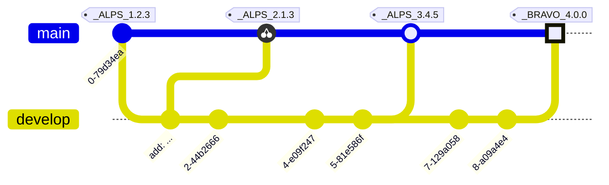

# RELEASE NOTES

All notable changes to this project will be documented in this file.

The format is based on [Keep a Changelog](https://keepachangelog.com/en/1.0.0/),
and this project adheres to a flavor of [Semantic Versioning](https://semver.org/spec/v2.0.0.html)
which includes [Scopes and Epochs](#epoch-scoped-semver).

---


#### Quick Navigation

**Scope** | Current Release | Commit Count
:--- | :---: | :---:
[**ActiveElement**](#activeelement) | [0.2.0](https://github.com/shayanhabibi/Partas.Solid.Primitives/commit/81927d566f505989ed8cc65559d37df764f3d4c9) | 1 commits
[**Audio**](#audio) | [0.1.1](https://github.com/shayanhabibi/Partas.Solid.Primitives/compare/_%28Audio%29_0.1.0..._%28Audio%29_0.1.1) | 5 commits
[**AutoFocus**](#autofocus) | [0.1.1](https://github.com/shayanhabibi/Partas.Solid.Primitives/compare/_%28AutoFocus%29_0.1.0..._%28AutoFocus%29_0.1.1) | 7 commits
[**Bounds**](#bounds) | [0.2.1](https://github.com/shayanhabibi/Partas.Solid.Primitives/compare/_%28Bounds%29_0.2.0..._%28Bounds%29_0.2.1) | 6 commits
[**BroadcastChannel**](#broadcastchannel) | [0.2.1](https://github.com/shayanhabibi/Partas.Solid.Primitives/compare/_%28BroadcastChannel%29_0.2.0..._%28BroadcastChannel%29_0.2.1) | 6 commits
[**Clipboard**](#clipboard) | [0.2.1](https://github.com/shayanhabibi/Partas.Solid.Primitives/compare/_%28Clipboard%29_0.2.0..._%28Clipboard%29_0.2.1) | 6 commits
[**Common**](#common) | [0.1.1](https://github.com/shayanhabibi/Partas.Solid.Primitives/compare/_%28Common%29_0.1.0..._%28Common%29_0.1.1) | 5 commits
[**Devices**](#devices) | [0.1.1](https://github.com/shayanhabibi/Partas.Solid.Primitives/compare/_%28Devices%29_0.1.0..._%28Devices%29_0.1.1) | 5 commits
[**EventBus**](#eventbus) | [0.2.1](https://github.com/shayanhabibi/Partas.Solid.Primitives/compare/_%28EventBus%29_0.2.0..._%28EventBus%29_0.2.1) | 6 commits
[**EventListener**](#eventlistener) | [0.1.1](https://github.com/shayanhabibi/Partas.Solid.Primitives/compare/_%28EventListener%29_0.1.0..._%28EventListener%29_0.1.1) | 5 commits
[**Idle**](#idle) | [0.2.1](https://github.com/shayanhabibi/Partas.Solid.Primitives/compare/_%28Idle%29_0.2.0..._%28Idle%29_0.2.1) | 6 commits
[**Keyboard**](#keyboard) | [0.2.1](https://github.com/shayanhabibi/Partas.Solid.Primitives/compare/_%28Keyboard%29_0.2.0..._%28Keyboard%29_0.2.1) | 6 commits
[**Media**](#media) | [0.2.1](https://github.com/shayanhabibi/Partas.Solid.Primitives/compare/_%28Media%29_0.2.0..._%28Media%29_0.2.1) | 6 commits
[**Mouse**](#mouse) | [0.2.1](https://github.com/shayanhabibi/Partas.Solid.Primitives/compare/_%28Mouse%29_0.2.0..._%28Mouse%29_0.2.1) | 8 commits
[**Primitives**](#primitives) | [0.4.0](https://github.com/shayanhabibi/Partas.Solid.Primitives/compare/_%28Primitives%29_0.3.2..._%28Primitives%29_0.4.0) | 10 commits
[**Raf**](#raf) | [0.2.1](https://github.com/shayanhabibi/Partas.Solid.Primitives/compare/_%28Raf%29_0.2.0..._%28Raf%29_0.2.1) | 6 commits
[**Rootless**](#rootless) | [0.1.0](https://github.com/shayanhabibi/Partas.Solid.Primitives/commit/c45df2215b9db6be771de98fad1d65d163e3825a) | 1 commits
[**Scheduled**](#scheduled) | [0.2.1](https://github.com/shayanhabibi/Partas.Solid.Primitives/compare/_%28Scheduled%29_0.2.0..._%28Scheduled%29_0.2.1) | 6 commits
[**Scroll**](#scroll) | [0.2.1](https://github.com/shayanhabibi/Partas.Solid.Primitives/compare/_%28Scroll%29_0.2.0..._%28Scroll%29_0.2.1) | 6 commits
[**Spring**](#spring) | [0.2.1](https://github.com/shayanhabibi/Partas.Solid.Primitives/compare/_%28Spring%29_0.2.0..._%28Spring%29_0.2.1) | 7 commits
[**Timer**](#timer) | [0.2.1](https://github.com/shayanhabibi/Partas.Solid.Primitives/compare/_%28Timer%29_0.2.0..._%28Timer%29_0.2.1) | 7 commits
[**Trigger**](#trigger) | [0.2.1](https://github.com/shayanhabibi/Partas.Solid.Primitives/compare/_%28Trigger%29_0.2.0..._%28Trigger%29_0.2.1) | 7 commits
[**Tween**](#tween) | [0.2.1](https://github.com/shayanhabibi/Partas.Solid.Primitives/compare/_%28Tween%29_0.2.0..._%28Tween%29_0.2.1) | 8 commits
[**InputMask**](#inputmask) | [0.1.0](https://github.com/shayanhabibi/Partas.Solid.Primitives/commit/c45df2215b9db6be771de98fad1d65d163e3825a) | None yet!


-----------------------

# ActiveElement

### [UNRELEASED](https://github.com/shayanhabibi/Partas.Solid.Primitives/compare/_%28ActiveElement%29_0.2.0...HEAD)

* add version for autofocus and active element by [@shayanhabibi](https://github.com/shayanhabibi/Partas.Solid.Primitives/shayanhabibi) with [#49bd0](https://github.com/shayanhabibi/Partas.Solid.Primitives/commit/49bd0a5113db02574cb407f3b1e40752aec01609)
  

<div align="right"><a href="#quick-navigation">(back to top)</a></div>

-----------------------

# Audio

### [UNRELEASED](https://github.com/shayanhabibi/Partas.Solid.Primitives/compare/_%28Audio%29_0.1.1...HEAD)

### [0.1.1](https://github.com/shayanhabibi/Partas.Solid.Primitives/compare/_%28Audio%29_0.1.0..._%28Audio%29_0.1.1) - (2025-08-21)

#### <!-- 2 --> Fixed

* add assembly infos to projects by [@shayanhabibi](https://github.com/shayanhabibi/Partas.Solid.Primitives/shayanhabibi) with [#8d03f](https://github.com/shayanhabibi/Partas.Solid.Primitives/commit/8d03fad141ec40953202c08ef2edbf9df818fc23)
  

#### <!-- 6 --> Others

* Add CI workflow using Partas.GitNet (#4) by [@cabboose](https://github.com/shayanhabibi/Partas.Solid.Primitives/cabboose) with [#c3975](https://github.com/shayanhabibi/Partas.Solid.Primitives/commit/c3975e312800671b18cc2608bbd294fbe13ee448)
  

* Simplify usage and namespaces (#1) by [@cabboose](https://github.com/shayanhabibi/Partas.Solid.Primitives/cabboose) with [#120be](https://github.com/shayanhabibi/Partas.Solid.Primitives/commit/120bebf6ac9680d3f7892df270b37d29864e4304)
  

* fantomas by [@shayanhabibi](https://github.com/shayanhabibi/Partas.Solid.Primitives/shayanhabibi) with [#a8f38](https://github.com/shayanhabibi/Partas.Solid.Primitives/commit/a8f3849c1a9cb589d98cc1220f79e5fbb80378bc)
  

* Add initial project files for Solid-js primitives bindings by [@cabboose](https://github.com/shayanhabibi/Partas.Solid.Primitives/cabboose) with [#968b5](https://github.com/shayanhabibi/Partas.Solid.Primitives/commit/968b55fcd4fa5913c84adb7374f3aef79c5acc61)
  

<div align="right"><a href="#quick-navigation">(back to top)</a></div>

-----------------------

# AutoFocus

### [UNRELEASED](https://github.com/shayanhabibi/Partas.Solid.Primitives/compare/_%28AutoFocus%29_0.1.1...HEAD)

* add version for autofocus and active element by [@shayanhabibi](https://github.com/shayanhabibi/Partas.Solid.Primitives/shayanhabibi) with [#49bd0](https://github.com/shayanhabibi/Partas.Solid.Primitives/commit/49bd0a5113db02574cb407f3b1e40752aec01609)
  

### [0.1.1](https://github.com/shayanhabibi/Partas.Solid.Primitives/compare/_%28AutoFocus%29_0.1.0..._%28AutoFocus%29_0.1.1) - (2025-08-21)

#### <!-- 2 --> Fixed

* add assembly infos to projects by [@shayanhabibi](https://github.com/shayanhabibi/Partas.Solid.Primitives/shayanhabibi) with [#8d03f](https://github.com/shayanhabibi/Partas.Solid.Primitives/commit/8d03fad141ec40953202c08ef2edbf9df818fc23)
  

#### <!-- 6 --> Others

* Add CI workflow using Partas.GitNet (#4) by [@cabboose](https://github.com/shayanhabibi/Partas.Solid.Primitives/cabboose) with [#c3975](https://github.com/shayanhabibi/Partas.Solid.Primitives/commit/c3975e312800671b18cc2608bbd294fbe13ee448)
  

* Simplify usage and namespaces (#1) by [@cabboose](https://github.com/shayanhabibi/Partas.Solid.Primitives/cabboose) with [#120be](https://github.com/shayanhabibi/Partas.Solid.Primitives/commit/120bebf6ac9680d3f7892df270b37d29864e4304)
  

* fantomas by [@shayanhabibi](https://github.com/shayanhabibi/Partas.Solid.Primitives/shayanhabibi) with [#a8f38](https://github.com/shayanhabibi/Partas.Solid.Primitives/commit/a8f3849c1a9cb589d98cc1220f79e5fbb80378bc)
  

* Update string literal paths and bump package versions by [@cabboose](https://github.com/shayanhabibi/Partas.Solid.Primitives/cabboose) with [#ae750](https://github.com/shayanhabibi/Partas.Solid.Primitives/commit/ae7506af672962ccd429029f18ee7808fbf62a79)
  

* Add initial project files for Solid-js primitives bindings by [@cabboose](https://github.com/shayanhabibi/Partas.Solid.Primitives/cabboose) with [#968b5](https://github.com/shayanhabibi/Partas.Solid.Primitives/commit/968b55fcd4fa5913c84adb7374f3aef79c5acc61)
  

<div align="right"><a href="#quick-navigation">(back to top)</a></div>

-----------------------

# Bounds

### [UNRELEASED](https://github.com/shayanhabibi/Partas.Solid.Primitives/compare/_%28Bounds%29_0.2.1...HEAD)

### [0.2.1](https://github.com/shayanhabibi/Partas.Solid.Primitives/compare/_%28Bounds%29_0.2.0..._%28Bounds%29_0.2.1) - (2025-08-21)

#### <!-- 2 --> Fixed

* add assembly infos to projects by [@shayanhabibi](https://github.com/shayanhabibi/Partas.Solid.Primitives/shayanhabibi) with [#8d03f](https://github.com/shayanhabibi/Partas.Solid.Primitives/commit/8d03fad141ec40953202c08ef2edbf9df818fc23)
  

#### <!-- 6 --> Others

* Add CI workflow using Partas.GitNet (#4) by [@cabboose](https://github.com/shayanhabibi/Partas.Solid.Primitives/cabboose) with [#c3975](https://github.com/shayanhabibi/Partas.Solid.Primitives/commit/c3975e312800671b18cc2608bbd294fbe13ee448)
  

* Simplify usage and namespaces (#1) by [@cabboose](https://github.com/shayanhabibi/Partas.Solid.Primitives/cabboose) with [#120be](https://github.com/shayanhabibi/Partas.Solid.Primitives/commit/120bebf6ac9680d3f7892df270b37d29864e4304)
  

* fantomas by [@shayanhabibi](https://github.com/shayanhabibi/Partas.Solid.Primitives/shayanhabibi) with [#a8f38](https://github.com/shayanhabibi/Partas.Solid.Primitives/commit/a8f3849c1a9cb589d98cc1220f79e5fbb80378bc)
  

* Update string literal paths and bump package versions by [@cabboose](https://github.com/shayanhabibi/Partas.Solid.Primitives/cabboose) with [#ae750](https://github.com/shayanhabibi/Partas.Solid.Primitives/commit/ae7506af672962ccd429029f18ee7808fbf62a79)
  

* Add initial project files for Solid-js primitives bindings by [@cabboose](https://github.com/shayanhabibi/Partas.Solid.Primitives/cabboose) with [#968b5](https://github.com/shayanhabibi/Partas.Solid.Primitives/commit/968b55fcd4fa5913c84adb7374f3aef79c5acc61)
  

<div align="right"><a href="#quick-navigation">(back to top)</a></div>

-----------------------

# BroadcastChannel

### [UNRELEASED](https://github.com/shayanhabibi/Partas.Solid.Primitives/compare/_%28BroadcastChannel%29_0.2.1...HEAD)

### [0.2.1](https://github.com/shayanhabibi/Partas.Solid.Primitives/compare/_%28BroadcastChannel%29_0.2.0..._%28BroadcastChannel%29_0.2.1) - (2025-08-21)

#### <!-- 2 --> Fixed

* add assembly infos to projects by [@shayanhabibi](https://github.com/shayanhabibi/Partas.Solid.Primitives/shayanhabibi) with [#8d03f](https://github.com/shayanhabibi/Partas.Solid.Primitives/commit/8d03fad141ec40953202c08ef2edbf9df818fc23)
  

#### <!-- 6 --> Others

* Add CI workflow using Partas.GitNet (#4) by [@cabboose](https://github.com/shayanhabibi/Partas.Solid.Primitives/cabboose) with [#c3975](https://github.com/shayanhabibi/Partas.Solid.Primitives/commit/c3975e312800671b18cc2608bbd294fbe13ee448)
  

* Simplify usage and namespaces (#1) by [@cabboose](https://github.com/shayanhabibi/Partas.Solid.Primitives/cabboose) with [#120be](https://github.com/shayanhabibi/Partas.Solid.Primitives/commit/120bebf6ac9680d3f7892df270b37d29864e4304)
  

* fantomas by [@shayanhabibi](https://github.com/shayanhabibi/Partas.Solid.Primitives/shayanhabibi) with [#a8f38](https://github.com/shayanhabibi/Partas.Solid.Primitives/commit/a8f3849c1a9cb589d98cc1220f79e5fbb80378bc)
  

* Update string literal paths and bump package versions by [@cabboose](https://github.com/shayanhabibi/Partas.Solid.Primitives/cabboose) with [#ae750](https://github.com/shayanhabibi/Partas.Solid.Primitives/commit/ae7506af672962ccd429029f18ee7808fbf62a79)
  

* Add initial project files for Solid-js primitives bindings by [@cabboose](https://github.com/shayanhabibi/Partas.Solid.Primitives/cabboose) with [#968b5](https://github.com/shayanhabibi/Partas.Solid.Primitives/commit/968b55fcd4fa5913c84adb7374f3aef79c5acc61)
  

<div align="right"><a href="#quick-navigation">(back to top)</a></div>

-----------------------

# Clipboard

### [UNRELEASED](https://github.com/shayanhabibi/Partas.Solid.Primitives/compare/_%28Clipboard%29_0.2.1...HEAD)

### [0.2.1](https://github.com/shayanhabibi/Partas.Solid.Primitives/compare/_%28Clipboard%29_0.2.0..._%28Clipboard%29_0.2.1) - (2025-08-21)

#### <!-- 2 --> Fixed

* add assembly infos to projects by [@shayanhabibi](https://github.com/shayanhabibi/Partas.Solid.Primitives/shayanhabibi) with [#8d03f](https://github.com/shayanhabibi/Partas.Solid.Primitives/commit/8d03fad141ec40953202c08ef2edbf9df818fc23)
  

#### <!-- 6 --> Others

* Add CI workflow using Partas.GitNet (#4) by [@cabboose](https://github.com/shayanhabibi/Partas.Solid.Primitives/cabboose) with [#c3975](https://github.com/shayanhabibi/Partas.Solid.Primitives/commit/c3975e312800671b18cc2608bbd294fbe13ee448)
  

* Simplify usage and namespaces (#1) by [@cabboose](https://github.com/shayanhabibi/Partas.Solid.Primitives/cabboose) with [#120be](https://github.com/shayanhabibi/Partas.Solid.Primitives/commit/120bebf6ac9680d3f7892df270b37d29864e4304)
  

* fantomas by [@shayanhabibi](https://github.com/shayanhabibi/Partas.Solid.Primitives/shayanhabibi) with [#a8f38](https://github.com/shayanhabibi/Partas.Solid.Primitives/commit/a8f3849c1a9cb589d98cc1220f79e5fbb80378bc)
  

* Update string literal paths and bump package versions by [@cabboose](https://github.com/shayanhabibi/Partas.Solid.Primitives/cabboose) with [#ae750](https://github.com/shayanhabibi/Partas.Solid.Primitives/commit/ae7506af672962ccd429029f18ee7808fbf62a79)
  

* Add initial project files for Solid-js primitives bindings by [@cabboose](https://github.com/shayanhabibi/Partas.Solid.Primitives/cabboose) with [#968b5](https://github.com/shayanhabibi/Partas.Solid.Primitives/commit/968b55fcd4fa5913c84adb7374f3aef79c5acc61)
  

<div align="right"><a href="#quick-navigation">(back to top)</a></div>

-----------------------

# Common

### [UNRELEASED](https://github.com/shayanhabibi/Partas.Solid.Primitives/compare/_%28Common%29_0.1.1...HEAD)

### [0.1.1](https://github.com/shayanhabibi/Partas.Solid.Primitives/compare/_%28Common%29_0.1.0..._%28Common%29_0.1.1) - (2025-08-21)

#### <!-- 2 --> Fixed

* add assembly infos to projects by [@shayanhabibi](https://github.com/shayanhabibi/Partas.Solid.Primitives/shayanhabibi) with [#8d03f](https://github.com/shayanhabibi/Partas.Solid.Primitives/commit/8d03fad141ec40953202c08ef2edbf9df818fc23)
  

#### <!-- 6 --> Others

* Add CI workflow using Partas.GitNet (#4) by [@cabboose](https://github.com/shayanhabibi/Partas.Solid.Primitives/cabboose) with [#c3975](https://github.com/shayanhabibi/Partas.Solid.Primitives/commit/c3975e312800671b18cc2608bbd294fbe13ee448)
  

* Simplify usage and namespaces (#1) by [@cabboose](https://github.com/shayanhabibi/Partas.Solid.Primitives/cabboose) with [#120be](https://github.com/shayanhabibi/Partas.Solid.Primitives/commit/120bebf6ac9680d3f7892df270b37d29864e4304)
  

* fantomas by [@shayanhabibi](https://github.com/shayanhabibi/Partas.Solid.Primitives/shayanhabibi) with [#a8f38](https://github.com/shayanhabibi/Partas.Solid.Primitives/commit/a8f3849c1a9cb589d98cc1220f79e5fbb80378bc)
  

* Add initial project files for Solid-js primitives bindings by [@cabboose](https://github.com/shayanhabibi/Partas.Solid.Primitives/cabboose) with [#968b5](https://github.com/shayanhabibi/Partas.Solid.Primitives/commit/968b55fcd4fa5913c84adb7374f3aef79c5acc61)
  

<div align="right"><a href="#quick-navigation">(back to top)</a></div>

-----------------------

# Devices

### [UNRELEASED](https://github.com/shayanhabibi/Partas.Solid.Primitives/compare/_%28Devices%29_0.1.1...HEAD)

### [0.1.1](https://github.com/shayanhabibi/Partas.Solid.Primitives/compare/_%28Devices%29_0.1.0..._%28Devices%29_0.1.1) - (2025-08-21)

#### <!-- 2 --> Fixed

* add assembly infos to projects by [@shayanhabibi](https://github.com/shayanhabibi/Partas.Solid.Primitives/shayanhabibi) with [#8d03f](https://github.com/shayanhabibi/Partas.Solid.Primitives/commit/8d03fad141ec40953202c08ef2edbf9df818fc23)
  

#### <!-- 6 --> Others

* Add CI workflow using Partas.GitNet (#4) by [@cabboose](https://github.com/shayanhabibi/Partas.Solid.Primitives/cabboose) with [#c3975](https://github.com/shayanhabibi/Partas.Solid.Primitives/commit/c3975e312800671b18cc2608bbd294fbe13ee448)
  

* Simplify usage and namespaces (#1) by [@cabboose](https://github.com/shayanhabibi/Partas.Solid.Primitives/cabboose) with [#120be](https://github.com/shayanhabibi/Partas.Solid.Primitives/commit/120bebf6ac9680d3f7892df270b37d29864e4304)
  

* fantomas by [@shayanhabibi](https://github.com/shayanhabibi/Partas.Solid.Primitives/shayanhabibi) with [#a8f38](https://github.com/shayanhabibi/Partas.Solid.Primitives/commit/a8f3849c1a9cb589d98cc1220f79e5fbb80378bc)
  

* Add initial project files for Solid-js primitives bindings by [@cabboose](https://github.com/shayanhabibi/Partas.Solid.Primitives/cabboose) with [#968b5](https://github.com/shayanhabibi/Partas.Solid.Primitives/commit/968b55fcd4fa5913c84adb7374f3aef79c5acc61)
  

<div align="right"><a href="#quick-navigation">(back to top)</a></div>

-----------------------

# EventBus

### [UNRELEASED](https://github.com/shayanhabibi/Partas.Solid.Primitives/compare/_%28EventBus%29_0.2.1...HEAD)

### [0.2.1](https://github.com/shayanhabibi/Partas.Solid.Primitives/compare/_%28EventBus%29_0.2.0..._%28EventBus%29_0.2.1) - (2025-08-21)

#### <!-- 2 --> Fixed

* add assembly infos to projects by [@shayanhabibi](https://github.com/shayanhabibi/Partas.Solid.Primitives/shayanhabibi) with [#8d03f](https://github.com/shayanhabibi/Partas.Solid.Primitives/commit/8d03fad141ec40953202c08ef2edbf9df818fc23)
  

#### <!-- 6 --> Others

* Add CI workflow using Partas.GitNet (#4) by [@cabboose](https://github.com/shayanhabibi/Partas.Solid.Primitives/cabboose) with [#c3975](https://github.com/shayanhabibi/Partas.Solid.Primitives/commit/c3975e312800671b18cc2608bbd294fbe13ee448)
  

* Simplify usage and namespaces (#1) by [@cabboose](https://github.com/shayanhabibi/Partas.Solid.Primitives/cabboose) with [#120be](https://github.com/shayanhabibi/Partas.Solid.Primitives/commit/120bebf6ac9680d3f7892df270b37d29864e4304)
  

* fantomas by [@shayanhabibi](https://github.com/shayanhabibi/Partas.Solid.Primitives/shayanhabibi) with [#a8f38](https://github.com/shayanhabibi/Partas.Solid.Primitives/commit/a8f3849c1a9cb589d98cc1220f79e5fbb80378bc)
  

* Update string literal paths and bump package versions by [@cabboose](https://github.com/shayanhabibi/Partas.Solid.Primitives/cabboose) with [#ae750](https://github.com/shayanhabibi/Partas.Solid.Primitives/commit/ae7506af672962ccd429029f18ee7808fbf62a79)
  

* Add initial project files for Solid-js primitives bindings by [@cabboose](https://github.com/shayanhabibi/Partas.Solid.Primitives/cabboose) with [#968b5](https://github.com/shayanhabibi/Partas.Solid.Primitives/commit/968b55fcd4fa5913c84adb7374f3aef79c5acc61)
  

<div align="right"><a href="#quick-navigation">(back to top)</a></div>

-----------------------

# EventListener

### [UNRELEASED](https://github.com/shayanhabibi/Partas.Solid.Primitives/compare/_%28EventListener%29_0.1.1...HEAD)

### [0.1.1](https://github.com/shayanhabibi/Partas.Solid.Primitives/compare/_%28EventListener%29_0.1.0..._%28EventListener%29_0.1.1) - (2025-08-21)

#### <!-- 2 --> Fixed

* add assembly infos to projects by [@shayanhabibi](https://github.com/shayanhabibi/Partas.Solid.Primitives/shayanhabibi) with [#8d03f](https://github.com/shayanhabibi/Partas.Solid.Primitives/commit/8d03fad141ec40953202c08ef2edbf9df818fc23)
  

#### <!-- 6 --> Others

* Add CI workflow using Partas.GitNet (#4) by [@cabboose](https://github.com/shayanhabibi/Partas.Solid.Primitives/cabboose) with [#c3975](https://github.com/shayanhabibi/Partas.Solid.Primitives/commit/c3975e312800671b18cc2608bbd294fbe13ee448)
  

* Simplify usage and namespaces (#1) by [@cabboose](https://github.com/shayanhabibi/Partas.Solid.Primitives/cabboose) with [#120be](https://github.com/shayanhabibi/Partas.Solid.Primitives/commit/120bebf6ac9680d3f7892df270b37d29864e4304)
  

* fantomas by [@shayanhabibi](https://github.com/shayanhabibi/Partas.Solid.Primitives/shayanhabibi) with [#a8f38](https://github.com/shayanhabibi/Partas.Solid.Primitives/commit/a8f3849c1a9cb589d98cc1220f79e5fbb80378bc)
  

* Add initial project files for Solid-js primitives bindings by [@cabboose](https://github.com/shayanhabibi/Partas.Solid.Primitives/cabboose) with [#968b5](https://github.com/shayanhabibi/Partas.Solid.Primitives/commit/968b55fcd4fa5913c84adb7374f3aef79c5acc61)
  

<div align="right"><a href="#quick-navigation">(back to top)</a></div>

-----------------------

# Idle

### [UNRELEASED](https://github.com/shayanhabibi/Partas.Solid.Primitives/compare/_%28Idle%29_0.2.1...HEAD)

### [0.2.1](https://github.com/shayanhabibi/Partas.Solid.Primitives/compare/_%28Idle%29_0.2.0..._%28Idle%29_0.2.1) - (2025-08-21)

#### <!-- 2 --> Fixed

* add assembly infos to projects by [@shayanhabibi](https://github.com/shayanhabibi/Partas.Solid.Primitives/shayanhabibi) with [#8d03f](https://github.com/shayanhabibi/Partas.Solid.Primitives/commit/8d03fad141ec40953202c08ef2edbf9df818fc23)
  

#### <!-- 6 --> Others

* Add CI workflow using Partas.GitNet (#4) by [@cabboose](https://github.com/shayanhabibi/Partas.Solid.Primitives/cabboose) with [#c3975](https://github.com/shayanhabibi/Partas.Solid.Primitives/commit/c3975e312800671b18cc2608bbd294fbe13ee448)
  

* Simplify usage and namespaces (#1) by [@cabboose](https://github.com/shayanhabibi/Partas.Solid.Primitives/cabboose) with [#120be](https://github.com/shayanhabibi/Partas.Solid.Primitives/commit/120bebf6ac9680d3f7892df270b37d29864e4304)
  

* fantomas by [@shayanhabibi](https://github.com/shayanhabibi/Partas.Solid.Primitives/shayanhabibi) with [#a8f38](https://github.com/shayanhabibi/Partas.Solid.Primitives/commit/a8f3849c1a9cb589d98cc1220f79e5fbb80378bc)
  

* Update string literal paths and bump package versions by [@cabboose](https://github.com/shayanhabibi/Partas.Solid.Primitives/cabboose) with [#ae750](https://github.com/shayanhabibi/Partas.Solid.Primitives/commit/ae7506af672962ccd429029f18ee7808fbf62a79)
  

* Add initial project files for Solid-js primitives bindings by [@cabboose](https://github.com/shayanhabibi/Partas.Solid.Primitives/cabboose) with [#968b5](https://github.com/shayanhabibi/Partas.Solid.Primitives/commit/968b55fcd4fa5913c84adb7374f3aef79c5acc61)
  

<div align="right"><a href="#quick-navigation">(back to top)</a></div>

-----------------------

# Keyboard

### [UNRELEASED](https://github.com/shayanhabibi/Partas.Solid.Primitives/compare/_%28Keyboard%29_0.2.1...HEAD)

### [0.2.1](https://github.com/shayanhabibi/Partas.Solid.Primitives/compare/_%28Keyboard%29_0.2.0..._%28Keyboard%29_0.2.1) - (2025-08-21)

#### <!-- 2 --> Fixed

* add assembly infos to projects by [@shayanhabibi](https://github.com/shayanhabibi/Partas.Solid.Primitives/shayanhabibi) with [#8d03f](https://github.com/shayanhabibi/Partas.Solid.Primitives/commit/8d03fad141ec40953202c08ef2edbf9df818fc23)
  

#### <!-- 6 --> Others

* Add CI workflow using Partas.GitNet (#4) by [@cabboose](https://github.com/shayanhabibi/Partas.Solid.Primitives/cabboose) with [#c3975](https://github.com/shayanhabibi/Partas.Solid.Primitives/commit/c3975e312800671b18cc2608bbd294fbe13ee448)
  

* Simplify usage and namespaces (#1) by [@cabboose](https://github.com/shayanhabibi/Partas.Solid.Primitives/cabboose) with [#120be](https://github.com/shayanhabibi/Partas.Solid.Primitives/commit/120bebf6ac9680d3f7892df270b37d29864e4304)
  

* fantomas by [@shayanhabibi](https://github.com/shayanhabibi/Partas.Solid.Primitives/shayanhabibi) with [#a8f38](https://github.com/shayanhabibi/Partas.Solid.Primitives/commit/a8f3849c1a9cb589d98cc1220f79e5fbb80378bc)
  

* Update string literal paths and bump package versions by [@cabboose](https://github.com/shayanhabibi/Partas.Solid.Primitives/cabboose) with [#ae750](https://github.com/shayanhabibi/Partas.Solid.Primitives/commit/ae7506af672962ccd429029f18ee7808fbf62a79)
  

* Add initial project files for Solid-js primitives bindings by [@cabboose](https://github.com/shayanhabibi/Partas.Solid.Primitives/cabboose) with [#968b5](https://github.com/shayanhabibi/Partas.Solid.Primitives/commit/968b55fcd4fa5913c84adb7374f3aef79c5acc61)
  

<div align="right"><a href="#quick-navigation">(back to top)</a></div>

-----------------------

# Media

### [UNRELEASED](https://github.com/shayanhabibi/Partas.Solid.Primitives/compare/_%28Media%29_0.2.1...HEAD)

### [0.2.1](https://github.com/shayanhabibi/Partas.Solid.Primitives/compare/_%28Media%29_0.2.0..._%28Media%29_0.2.1) - (2025-08-21)

#### <!-- 2 --> Fixed

* add assembly infos to projects by [@shayanhabibi](https://github.com/shayanhabibi/Partas.Solid.Primitives/shayanhabibi) with [#8d03f](https://github.com/shayanhabibi/Partas.Solid.Primitives/commit/8d03fad141ec40953202c08ef2edbf9df818fc23)
  

#### <!-- 6 --> Others

* Add CI workflow using Partas.GitNet (#4) by [@cabboose](https://github.com/shayanhabibi/Partas.Solid.Primitives/cabboose) with [#c3975](https://github.com/shayanhabibi/Partas.Solid.Primitives/commit/c3975e312800671b18cc2608bbd294fbe13ee448)
  

* Simplify usage and namespaces (#1) by [@cabboose](https://github.com/shayanhabibi/Partas.Solid.Primitives/cabboose) with [#120be](https://github.com/shayanhabibi/Partas.Solid.Primitives/commit/120bebf6ac9680d3f7892df270b37d29864e4304)
  

* fantomas by [@shayanhabibi](https://github.com/shayanhabibi/Partas.Solid.Primitives/shayanhabibi) with [#a8f38](https://github.com/shayanhabibi/Partas.Solid.Primitives/commit/a8f3849c1a9cb589d98cc1220f79e5fbb80378bc)
  

* Update string literal paths and bump package versions by [@cabboose](https://github.com/shayanhabibi/Partas.Solid.Primitives/cabboose) with [#ae750](https://github.com/shayanhabibi/Partas.Solid.Primitives/commit/ae7506af672962ccd429029f18ee7808fbf62a79)
  

* Add initial project files for Solid-js primitives bindings by [@cabboose](https://github.com/shayanhabibi/Partas.Solid.Primitives/cabboose) with [#968b5](https://github.com/shayanhabibi/Partas.Solid.Primitives/commit/968b55fcd4fa5913c84adb7374f3aef79c5acc61)
  

<div align="right"><a href="#quick-navigation">(back to top)</a></div>

-----------------------

# Mouse

### [UNRELEASED](https://github.com/shayanhabibi/Partas.Solid.Primitives/compare/_%28Mouse%29_0.2.1...HEAD)

### [0.2.1](https://github.com/shayanhabibi/Partas.Solid.Primitives/compare/_%28Mouse%29_0.2.0..._%28Mouse%29_0.2.1) - (2025-08-21)

#### <!-- 2 --> Fixed

* add assembly infos to projects by [@shayanhabibi](https://github.com/shayanhabibi/Partas.Solid.Primitives/shayanhabibi) with [#8d03f](https://github.com/shayanhabibi/Partas.Solid.Primitives/commit/8d03fad141ec40953202c08ef2edbf9df818fc23)
  

#### <!-- 6 --> Others

* =MOUSE= HOTFIX: Remove # to prevent compiler type ambiguity by [@cabboose](https://github.com/shayanhabibi/Partas.Solid.Primitives/cabboose) with [#43f2a](https://github.com/shayanhabibi/Partas.Solid.Primitives/commit/43f2a1edf0b48fdb3e7839db33d4198089dcafea)
  

* Add CI workflow using Partas.GitNet (#4) by [@cabboose](https://github.com/shayanhabibi/Partas.Solid.Primitives/cabboose) with [#c3975](https://github.com/shayanhabibi/Partas.Solid.Primitives/commit/c3975e312800671b18cc2608bbd294fbe13ee448)
  

* Simplify usage and namespaces (#1) by [@cabboose](https://github.com/shayanhabibi/Partas.Solid.Primitives/cabboose) with [#120be](https://github.com/shayanhabibi/Partas.Solid.Primitives/commit/120bebf6ac9680d3f7892df270b37d29864e4304)
  

* =MOUSE= REFACTOR: Type signatures now use U4<#HtmlElement, #Element, Document, Window> to better provide accessibility as per the source typings by [@cabboose](https://github.com/shayanhabibi/Partas.Solid.Primitives/cabboose) with [#36668](https://github.com/shayanhabibi/Partas.Solid.Primitives/commit/366688030fcab6e1b2da63fc2d8d52dc5daafe43)
  

* =MOUSE= ADDED: Added bindings by [@cabboose](https://github.com/shayanhabibi/Partas.Solid.Primitives/cabboose) with [#f6dcd](https://github.com/shayanhabibi/Partas.Solid.Primitives/commit/f6dcd731900a51504858d0d672eca0a7c1d50aec)
  

* fantomas by [@shayanhabibi](https://github.com/shayanhabibi/Partas.Solid.Primitives/shayanhabibi) with [#a8f38](https://github.com/shayanhabibi/Partas.Solid.Primitives/commit/a8f3849c1a9cb589d98cc1220f79e5fbb80378bc)
  

* Add initial project files for Solid-js primitives bindings by [@cabboose](https://github.com/shayanhabibi/Partas.Solid.Primitives/cabboose) with [#968b5](https://github.com/shayanhabibi/Partas.Solid.Primitives/commit/968b55fcd4fa5913c84adb7374f3aef79c5acc61)
  

<div align="right"><a href="#quick-navigation">(back to top)</a></div>

-----------------------

# Primitives

### [UNRELEASED](https://github.com/shayanhabibi/Partas.Solid.Primitives/compare/_%28Primitives%29_0.4.0...HEAD)

* input-mask and rootless bindings by [@shayanhabibi](https://github.com/shayanhabibi/Partas.Solid.Primitives/shayanhabibi) with [#ca450](https://github.com/shayanhabibi/Partas.Solid.Primitives/commit/ca450ed805507a88249f57ffcfbaff099aa061a0)
  

### [0.4.0](https://github.com/shayanhabibi/Partas.Solid.Primitives/compare/_%28Primitives%29_0.3.2..._%28Primitives%29_0.4.0) - (2025-09-19)

#### <!-- 6 --> Others

* input-mask and rootless bindings by [@shayanhabibi](https://github.com/shayanhabibi/Partas.Solid.Primitives/shayanhabibi) with [#ca450](https://github.com/shayanhabibi/Partas.Solid.Primitives/commit/ca450ed805507a88249f57ffcfbaff099aa061a0)
  

### [0.3.2](https://github.com/shayanhabibi/Partas.Solid.Primitives/compare/_%28Primitives%29_0.3.1..._%28Primitives%29_0.3.2) - (2025-09-06)

#### <!-- 2 --> Fixed

* prevent fable error for global mutable in stub by [@shayanhabibi](https://github.com/shayanhabibi/Partas.Solid.Primitives/shayanhabibi) with [#ee7b7](https://github.com/shayanhabibi/Partas.Solid.Primitives/commit/ee7b721ff228d0975ce604683bb2cd932024ddfb)
  

### [0.3.1](https://github.com/shayanhabibi/Partas.Solid.Primitives/compare/_%28Primitives%29_0.3.0..._%28Primitives%29_0.3.1) - (2025-08-21)

#### <!-- 2 --> Fixed

* testing gitnet patching by [@shayanhabibi](https://github.com/shayanhabibi/Partas.Solid.Primitives/shayanhabibi) with [#553e9](https://github.com/shayanhabibi/Partas.Solid.Primitives/commit/553e94de7ff54547d8769327323bb5dc54f963c5)
  

* add assembly infos to projects by [@shayanhabibi](https://github.com/shayanhabibi/Partas.Solid.Primitives/shayanhabibi) with [#8d03f](https://github.com/shayanhabibi/Partas.Solid.Primitives/commit/8d03fad141ec40953202c08ef2edbf9df818fc23)
  

#### <!-- 6 --> Others

* Add CI workflow using Partas.GitNet (#4) by [@cabboose](https://github.com/shayanhabibi/Partas.Solid.Primitives/cabboose) with [#c3975](https://github.com/shayanhabibi/Partas.Solid.Primitives/commit/c3975e312800671b18cc2608bbd294fbe13ee448)
  

* Simplify usage and namespaces (#1) by [@cabboose](https://github.com/shayanhabibi/Partas.Solid.Primitives/cabboose) with [#120be](https://github.com/shayanhabibi/Partas.Solid.Primitives/commit/120bebf6ac9680d3f7892df270b37d29864e4304)
  

* fantomas by [@shayanhabibi](https://github.com/shayanhabibi/Partas.Solid.Primitives/shayanhabibi) with [#a8f38](https://github.com/shayanhabibi/Partas.Solid.Primitives/commit/a8f3849c1a9cb589d98cc1220f79e5fbb80378bc)
  

* Update string literal paths and bump package versions by [@cabboose](https://github.com/shayanhabibi/Partas.Solid.Primitives/cabboose) with [#ae750](https://github.com/shayanhabibi/Partas.Solid.Primitives/commit/ae7506af672962ccd429029f18ee7808fbf62a79)
  

* Add initial project files for Solid-js primitives bindings by [@cabboose](https://github.com/shayanhabibi/Partas.Solid.Primitives/cabboose) with [#968b5](https://github.com/shayanhabibi/Partas.Solid.Primitives/commit/968b55fcd4fa5913c84adb7374f3aef79c5acc61)
  

<div align="right"><a href="#quick-navigation">(back to top)</a></div>

-----------------------

# Raf

### [UNRELEASED](https://github.com/shayanhabibi/Partas.Solid.Primitives/compare/_%28Raf%29_0.2.1...HEAD)

### [0.2.1](https://github.com/shayanhabibi/Partas.Solid.Primitives/compare/_%28Raf%29_0.2.0..._%28Raf%29_0.2.1) - (2025-08-21)

#### <!-- 2 --> Fixed

* add assembly infos to projects by [@shayanhabibi](https://github.com/shayanhabibi/Partas.Solid.Primitives/shayanhabibi) with [#8d03f](https://github.com/shayanhabibi/Partas.Solid.Primitives/commit/8d03fad141ec40953202c08ef2edbf9df818fc23)
  

#### <!-- 6 --> Others

* Add CI workflow using Partas.GitNet (#4) by [@cabboose](https://github.com/shayanhabibi/Partas.Solid.Primitives/cabboose) with [#c3975](https://github.com/shayanhabibi/Partas.Solid.Primitives/commit/c3975e312800671b18cc2608bbd294fbe13ee448)
  

* Simplify usage and namespaces (#1) by [@cabboose](https://github.com/shayanhabibi/Partas.Solid.Primitives/cabboose) with [#120be](https://github.com/shayanhabibi/Partas.Solid.Primitives/commit/120bebf6ac9680d3f7892df270b37d29864e4304)
  

* =RAF= ADDED: Added bindings to @solid-primitives/raf by [@cabboose](https://github.com/shayanhabibi/Partas.Solid.Primitives/cabboose) with [#1eaa1](https://github.com/shayanhabibi/Partas.Solid.Primitives/commit/1eaa159caa8c3dfba2a6d86eae1ec460628a45d3)
  

* fantomas by [@shayanhabibi](https://github.com/shayanhabibi/Partas.Solid.Primitives/shayanhabibi) with [#a8f38](https://github.com/shayanhabibi/Partas.Solid.Primitives/commit/a8f3849c1a9cb589d98cc1220f79e5fbb80378bc)
  

* Add initial project files for Solid-js primitives bindings by [@cabboose](https://github.com/shayanhabibi/Partas.Solid.Primitives/cabboose) with [#968b5](https://github.com/shayanhabibi/Partas.Solid.Primitives/commit/968b55fcd4fa5913c84adb7374f3aef79c5acc61)
  

<div align="right"><a href="#quick-navigation">(back to top)</a></div>

-----------------------

# Rootless

### [UNRELEASED](https://github.com/shayanhabibi/Partas.Solid.Primitives/compare/_%28Rootless%29_0.1.0...HEAD)

* input-mask and rootless bindings by [@shayanhabibi](https://github.com/shayanhabibi/Partas.Solid.Primitives/shayanhabibi) with [#ca450](https://github.com/shayanhabibi/Partas.Solid.Primitives/commit/ca450ed805507a88249f57ffcfbaff099aa061a0)
  

<div align="right"><a href="#quick-navigation">(back to top)</a></div>

-----------------------

# Scheduled

### [UNRELEASED](https://github.com/shayanhabibi/Partas.Solid.Primitives/compare/_%28Scheduled%29_0.2.1...HEAD)

### [0.2.1](https://github.com/shayanhabibi/Partas.Solid.Primitives/compare/_%28Scheduled%29_0.2.0..._%28Scheduled%29_0.2.1) - (2025-08-21)

#### <!-- 2 --> Fixed

* add assembly infos to projects by [@shayanhabibi](https://github.com/shayanhabibi/Partas.Solid.Primitives/shayanhabibi) with [#8d03f](https://github.com/shayanhabibi/Partas.Solid.Primitives/commit/8d03fad141ec40953202c08ef2edbf9df818fc23)
  

#### <!-- 6 --> Others

* Add CI workflow using Partas.GitNet (#4) by [@cabboose](https://github.com/shayanhabibi/Partas.Solid.Primitives/cabboose) with [#c3975](https://github.com/shayanhabibi/Partas.Solid.Primitives/commit/c3975e312800671b18cc2608bbd294fbe13ee448)
  

* Simplify usage and namespaces (#1) by [@cabboose](https://github.com/shayanhabibi/Partas.Solid.Primitives/cabboose) with [#120be](https://github.com/shayanhabibi/Partas.Solid.Primitives/commit/120bebf6ac9680d3f7892df270b37d29864e4304)
  

* fantomas by [@shayanhabibi](https://github.com/shayanhabibi/Partas.Solid.Primitives/shayanhabibi) with [#a8f38](https://github.com/shayanhabibi/Partas.Solid.Primitives/commit/a8f3849c1a9cb589d98cc1220f79e5fbb80378bc)
  

* Update string literal paths and bump package versions by [@cabboose](https://github.com/shayanhabibi/Partas.Solid.Primitives/cabboose) with [#ae750](https://github.com/shayanhabibi/Partas.Solid.Primitives/commit/ae7506af672962ccd429029f18ee7808fbf62a79)
  

* Add initial project files for Solid-js primitives bindings by [@cabboose](https://github.com/shayanhabibi/Partas.Solid.Primitives/cabboose) with [#968b5](https://github.com/shayanhabibi/Partas.Solid.Primitives/commit/968b55fcd4fa5913c84adb7374f3aef79c5acc61)
  

<div align="right"><a href="#quick-navigation">(back to top)</a></div>

-----------------------

# Scroll

### [UNRELEASED](https://github.com/shayanhabibi/Partas.Solid.Primitives/compare/_%28Scroll%29_0.2.1...HEAD)

### [0.2.1](https://github.com/shayanhabibi/Partas.Solid.Primitives/compare/_%28Scroll%29_0.2.0..._%28Scroll%29_0.2.1) - (2025-08-21)

#### <!-- 2 --> Fixed

* add assembly infos to projects by [@shayanhabibi](https://github.com/shayanhabibi/Partas.Solid.Primitives/shayanhabibi) with [#8d03f](https://github.com/shayanhabibi/Partas.Solid.Primitives/commit/8d03fad141ec40953202c08ef2edbf9df818fc23)
  

#### <!-- 6 --> Others

* Add CI workflow using Partas.GitNet (#4) by [@cabboose](https://github.com/shayanhabibi/Partas.Solid.Primitives/cabboose) with [#c3975](https://github.com/shayanhabibi/Partas.Solid.Primitives/commit/c3975e312800671b18cc2608bbd294fbe13ee448)
  

* Simplify usage and namespaces (#1) by [@cabboose](https://github.com/shayanhabibi/Partas.Solid.Primitives/cabboose) with [#120be](https://github.com/shayanhabibi/Partas.Solid.Primitives/commit/120bebf6ac9680d3f7892df270b37d29864e4304)
  

* fantomas by [@shayanhabibi](https://github.com/shayanhabibi/Partas.Solid.Primitives/shayanhabibi) with [#a8f38](https://github.com/shayanhabibi/Partas.Solid.Primitives/commit/a8f3849c1a9cb589d98cc1220f79e5fbb80378bc)
  

* Update string literal paths and bump package versions by [@cabboose](https://github.com/shayanhabibi/Partas.Solid.Primitives/cabboose) with [#ae750](https://github.com/shayanhabibi/Partas.Solid.Primitives/commit/ae7506af672962ccd429029f18ee7808fbf62a79)
  

* Add initial project files for Solid-js primitives bindings by [@cabboose](https://github.com/shayanhabibi/Partas.Solid.Primitives/cabboose) with [#968b5](https://github.com/shayanhabibi/Partas.Solid.Primitives/commit/968b55fcd4fa5913c84adb7374f3aef79c5acc61)
  

<div align="right"><a href="#quick-navigation">(back to top)</a></div>

-----------------------

# Spring

### [UNRELEASED](https://github.com/shayanhabibi/Partas.Solid.Primitives/compare/_%28Spring%29_0.2.1...HEAD)

### [0.2.1](https://github.com/shayanhabibi/Partas.Solid.Primitives/compare/_%28Spring%29_0.2.0..._%28Spring%29_0.2.1) - (2025-08-21)

#### <!-- 2 --> Fixed

* add assembly infos to projects by [@shayanhabibi](https://github.com/shayanhabibi/Partas.Solid.Primitives/shayanhabibi) with [#8d03f](https://github.com/shayanhabibi/Partas.Solid.Primitives/commit/8d03fad141ec40953202c08ef2edbf9df818fc23)
  

#### <!-- 6 --> Others

* =SPRING= 0.1.0 ADDED: implementation by [@cabboose](https://github.com/shayanhabibi/Partas.Solid.Primitives/cabboose) with [#c058b](https://github.com/shayanhabibi/Partas.Solid.Primitives/commit/c058bee3484ff5b089105360fcce3996466cec53)
  

* gitcliff 2.10 by [@shayanhabibi](https://github.com/shayanhabibi/Partas.Solid.Primitives/shayanhabibi) with [#02d1e](https://github.com/shayanhabibi/Partas.Solid.Primitives/commit/02d1e793cea72b4477ede1c3d13e425fea92b638)
  

* Add CI workflow using Partas.GitNet (#4) by [@cabboose](https://github.com/shayanhabibi/Partas.Solid.Primitives/cabboose) with [#c3975](https://github.com/shayanhabibi/Partas.Solid.Primitives/commit/c3975e312800671b18cc2608bbd294fbe13ee448)
  

* Simplify usage and namespaces (#1) by [@cabboose](https://github.com/shayanhabibi/Partas.Solid.Primitives/cabboose) with [#120be](https://github.com/shayanhabibi/Partas.Solid.Primitives/commit/120bebf6ac9680d3f7892df270b37d29864e4304)
  

* fantomas by [@shayanhabibi](https://github.com/shayanhabibi/Partas.Solid.Primitives/shayanhabibi) with [#a8f38](https://github.com/shayanhabibi/Partas.Solid.Primitives/commit/a8f3849c1a9cb589d98cc1220f79e5fbb80378bc)
  

* Add initial project files for Solid-js primitives bindings by [@cabboose](https://github.com/shayanhabibi/Partas.Solid.Primitives/cabboose) with [#968b5](https://github.com/shayanhabibi/Partas.Solid.Primitives/commit/968b55fcd4fa5913c84adb7374f3aef79c5acc61)
  

<div align="right"><a href="#quick-navigation">(back to top)</a></div>

-----------------------

# Timer

### [UNRELEASED](https://github.com/shayanhabibi/Partas.Solid.Primitives/compare/_%28Timer%29_0.2.1...HEAD)

### [0.2.1](https://github.com/shayanhabibi/Partas.Solid.Primitives/compare/_%28Timer%29_0.2.0..._%28Timer%29_0.2.1) - (2025-08-21)

#### <!-- 2 --> Fixed

* add assembly infos to projects by [@shayanhabibi](https://github.com/shayanhabibi/Partas.Solid.Primitives/shayanhabibi) with [#8d03f](https://github.com/shayanhabibi/Partas.Solid.Primitives/commit/8d03fad141ec40953202c08ef2edbf9df818fc23)
  

#### <!-- 6 --> Others

* gitcliff 2.10 by [@shayanhabibi](https://github.com/shayanhabibi/Partas.Solid.Primitives/shayanhabibi) with [#02d1e](https://github.com/shayanhabibi/Partas.Solid.Primitives/commit/02d1e793cea72b4477ede1c3d13e425fea92b638)
  

* Add CI workflow using Partas.GitNet (#4) by [@cabboose](https://github.com/shayanhabibi/Partas.Solid.Primitives/cabboose) with [#c3975](https://github.com/shayanhabibi/Partas.Solid.Primitives/commit/c3975e312800671b18cc2608bbd294fbe13ee448)
  

* Simplify usage and namespaces (#1) by [@cabboose](https://github.com/shayanhabibi/Partas.Solid.Primitives/cabboose) with [#120be](https://github.com/shayanhabibi/Partas.Solid.Primitives/commit/120bebf6ac9680d3f7892df270b37d29864e4304)
  

* fantomas by [@shayanhabibi](https://github.com/shayanhabibi/Partas.Solid.Primitives/shayanhabibi) with [#a8f38](https://github.com/shayanhabibi/Partas.Solid.Primitives/commit/a8f3849c1a9cb589d98cc1220f79e5fbb80378bc)
  

* Update string literal paths and bump package versions by [@cabboose](https://github.com/shayanhabibi/Partas.Solid.Primitives/cabboose) with [#ae750](https://github.com/shayanhabibi/Partas.Solid.Primitives/commit/ae7506af672962ccd429029f18ee7808fbf62a79)
  

* Add initial project files for Solid-js primitives bindings by [@cabboose](https://github.com/shayanhabibi/Partas.Solid.Primitives/cabboose) with [#968b5](https://github.com/shayanhabibi/Partas.Solid.Primitives/commit/968b55fcd4fa5913c84adb7374f3aef79c5acc61)
  

<div align="right"><a href="#quick-navigation">(back to top)</a></div>

-----------------------

# Trigger

### [UNRELEASED](https://github.com/shayanhabibi/Partas.Solid.Primitives/compare/_%28Trigger%29_0.2.1...HEAD)

### [0.2.1](https://github.com/shayanhabibi/Partas.Solid.Primitives/compare/_%28Trigger%29_0.2.0..._%28Trigger%29_0.2.1) - (2025-08-21)

#### <!-- 2 --> Fixed

* add assembly infos to projects by [@shayanhabibi](https://github.com/shayanhabibi/Partas.Solid.Primitives/shayanhabibi) with [#8d03f](https://github.com/shayanhabibi/Partas.Solid.Primitives/commit/8d03fad141ec40953202c08ef2edbf9df818fc23)
  

#### <!-- 6 --> Others

* gitcliff 2.10 by [@shayanhabibi](https://github.com/shayanhabibi/Partas.Solid.Primitives/shayanhabibi) with [#02d1e](https://github.com/shayanhabibi/Partas.Solid.Primitives/commit/02d1e793cea72b4477ede1c3d13e425fea92b638)
  

* Add CI workflow using Partas.GitNet (#4) by [@cabboose](https://github.com/shayanhabibi/Partas.Solid.Primitives/cabboose) with [#c3975](https://github.com/shayanhabibi/Partas.Solid.Primitives/commit/c3975e312800671b18cc2608bbd294fbe13ee448)
  

* Simplify usage and namespaces (#1) by [@cabboose](https://github.com/shayanhabibi/Partas.Solid.Primitives/cabboose) with [#120be](https://github.com/shayanhabibi/Partas.Solid.Primitives/commit/120bebf6ac9680d3f7892df270b37d29864e4304)
  

* fantomas by [@shayanhabibi](https://github.com/shayanhabibi/Partas.Solid.Primitives/shayanhabibi) with [#a8f38](https://github.com/shayanhabibi/Partas.Solid.Primitives/commit/a8f3849c1a9cb589d98cc1220f79e5fbb80378bc)
  

* Update string literal paths and bump package versions by [@cabboose](https://github.com/shayanhabibi/Partas.Solid.Primitives/cabboose) with [#ae750](https://github.com/shayanhabibi/Partas.Solid.Primitives/commit/ae7506af672962ccd429029f18ee7808fbf62a79)
  

* Add initial project files for Solid-js primitives bindings by [@cabboose](https://github.com/shayanhabibi/Partas.Solid.Primitives/cabboose) with [#968b5](https://github.com/shayanhabibi/Partas.Solid.Primitives/commit/968b55fcd4fa5913c84adb7374f3aef79c5acc61)
  

<div align="right"><a href="#quick-navigation">(back to top)</a></div>

-----------------------

# Tween

### [UNRELEASED](https://github.com/shayanhabibi/Partas.Solid.Primitives/compare/_%28Tween%29_0.2.1...HEAD)

### [0.2.1](https://github.com/shayanhabibi/Partas.Solid.Primitives/compare/_%28Tween%29_0.2.0..._%28Tween%29_0.2.1) - (2025-08-21)

#### <!-- 2 --> Fixed

* add assembly infos to projects by [@shayanhabibi](https://github.com/shayanhabibi/Partas.Solid.Primitives/shayanhabibi) with [#8d03f](https://github.com/shayanhabibi/Partas.Solid.Primitives/commit/8d03fad141ec40953202c08ef2edbf9df818fc23)
  

#### <!-- 6 --> Others

* =SPRING= 0.1.0 ADDED: implementation by [@cabboose](https://github.com/shayanhabibi/Partas.Solid.Primitives/cabboose) with [#c058b](https://github.com/shayanhabibi/Partas.Solid.Primitives/commit/c058bee3484ff5b089105360fcce3996466cec53)
  

* gitcliff 2.10 by [@shayanhabibi](https://github.com/shayanhabibi/Partas.Solid.Primitives/shayanhabibi) with [#02d1e](https://github.com/shayanhabibi/Partas.Solid.Primitives/commit/02d1e793cea72b4477ede1c3d13e425fea92b638)
  

* Add CI workflow using Partas.GitNet (#4) by [@cabboose](https://github.com/shayanhabibi/Partas.Solid.Primitives/cabboose) with [#c3975](https://github.com/shayanhabibi/Partas.Solid.Primitives/commit/c3975e312800671b18cc2608bbd294fbe13ee448)
  

* Simplify usage and namespaces (#1) by [@cabboose](https://github.com/shayanhabibi/Partas.Solid.Primitives/cabboose) with [#120be](https://github.com/shayanhabibi/Partas.Solid.Primitives/commit/120bebf6ac9680d3f7892df270b37d29864e4304)
  

* fantomas by [@shayanhabibi](https://github.com/shayanhabibi/Partas.Solid.Primitives/shayanhabibi) with [#a8f38](https://github.com/shayanhabibi/Partas.Solid.Primitives/commit/a8f3849c1a9cb589d98cc1220f79e5fbb80378bc)
  

* Update string literal paths and bump package versions by [@cabboose](https://github.com/shayanhabibi/Partas.Solid.Primitives/cabboose) with [#ae750](https://github.com/shayanhabibi/Partas.Solid.Primitives/commit/ae7506af672962ccd429029f18ee7808fbf62a79)
  

* Add initial project files for Solid-js primitives bindings by [@cabboose](https://github.com/shayanhabibi/Partas.Solid.Primitives/cabboose) with [#968b5](https://github.com/shayanhabibi/Partas.Solid.Primitives/commit/968b55fcd4fa5913c84adb7374f3aef79c5acc61)
  

<div align="right"><a href="#quick-navigation">(back to top)</a></div>

-----------------------

# InputMask

No commits at this time.


---

<details>
<summary>Read more about this SemVer flavor</summary>

### Epoch Scoped SemVer

This flavor adds an optional marketable value called an `EPOCH`.
There is also an optional disambiguating `SCOPE` identifier for delineating tags for packages in a mono repo.

<blockquote>The motivation for this is to prevent resistance to utilising SemVer major bumps
correctly, by allowing a separate marketable identifier which is easily compatible
with the current SemVer spec.</blockquote>


An Epoch/Scope (*Sepoch*) is an OPTIONAL prefix to a typical SemVer.

* A Sepoch MUST BE bounded by `_` underscores `_`.
* The identifiers MUST BE ALPHABETICAL (A-Za-z) identifiers.
* The Epoch SHOULD BE upper case
* The Epoch MUST come before the Scope, if both are present.
* The Scope MUST additionally be bounded by `(` parenthesis `)`.
* The Scope SHOULD BE capitalised/pascal cased.
* A Sepoch CAN BE separated from SemVer by a single white space where this is allowed (ie not allowed in git tags).
* Epoch DOES NOT influence precedence.
* Scope MUST uniquely identify a single components versioning.
* Different scopes CANNOT BE compared for precedence.
* A SemVer without a Scope CAN BE compared to a Scoped SemVer for compatibility. But caution is advised.

> There is no enforcement for ordering EPOCHs in this spec, as it
would be overly restrictive and yield little value since we can delineate and
earlier EPOCH from a later EPOCH by the SemVers.

#### Example



*While there are breaking changes between versions 1 to 3, we expect that it is less than
from 3 to 4. We expect the API surface would change more dramatically, or there is some other significant
milestone improvement, in the change from version 3 epoch ALPS to version 4 epoch BRAVO.*

```
_WILDLANDS(Core)_ 4.2.0
_WILDLANDS(Engine)_ 0.5.3
_DELTA(Core)_ 5.0.0
_DELTA(Engine)_ 0.5.3
```

*Cannot be compared to `Core` versions. Both Engine versions are equal, we can identify that
the ecosystems marketed change does not change the Engine packages API*

</details>

<!-- generated by Partas.GitNet -->
